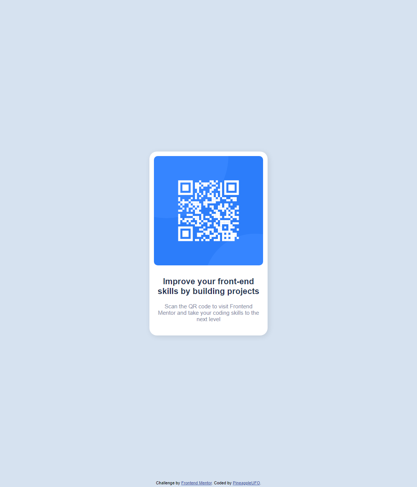

# Frontend Mentor - QR code component solution

This is a solution to the [QR code component challenge on Frontend Mentor](https://www.frontendmentor.io/challenges/qr-code-component-iux_sIO_H). Frontend Mentor challenges help you improve your coding skills by building realistic projects. 

## Table of contents

- [Frontend Mentor - QR code component solution](#frontend-mentor---qr-code-component-solution)
  - [Table of contents](#table-of-contents)
  - [Overview](#overview)
    - [Screenshot](#screenshot)
  - [](#)
    - [Links](#links)
    - [Built with](#built-with)
    - [What I learned](#what-i-learned)
      - [I learned how to use CSS variables](#i-learned-how-to-use-css-variables)
      - [See why](#see-why)
      - [I figured out box-shadow](#i-figured-out-box-shadow)
      - [Started my first git hub pages](#started-my-first-git-hub-pages)
  - [Author](#author)

## Overview
Qr Code card component

### Screenshot


---
### Links

- Solution URL: [GitHub] (https://github.com/PineappleUFO/qr-code-component-main)
- Live Site URL: [GitHub Pages](https://pineappleufo.github.io/qr-code-component-main/)
---
### Built with

- Semantic HTML5 markup
- CSS custom properties
- Flexbox
---
### What I learned

#### I learned how to use CSS variables

```css
  :root {

      @import url('https://fonts.googleapis.com/css2?family=Outfit:wght@400;700&display=swap');

      /* Colors */
      --white: hsl(0, 0%, 100%);
      --lightGray: hsl(212, 45%, 89%);
      --grayishBlue: hsl(220, 15%, 55%);
      --darkBlue: hsl(218, 44%, 22%);

      /* Typography */
      --paragraphFontSize: 15px;

    }

```

```css
    .description {
      text-align: center;
      color: var(--grayishBlue);
      font-size: var(--paragraphFontSize);
      font-weight: 400;
    }
```
---

#### See why 
```css 
html,body
    {
      height: 100%;
    }  
```
don't work separately 
```css 
html {
      height: 100%;
    }  
```
or   
```css 
body
    {
      height: 100%;
    }  
```

By default, ```<html>``` has no implicit height in most browsers, so assigning height: 100% to this element may not work.

However, when two html,body selectors are combined and styles are assigned to these combined selectors, height: 100% will be applied to both ```<html>``` and ```<body>``` elements. This is because web browsers usually set the height of ```<body>``` to match the height of ```<html>```, so applying height: 100% to the entire combined selector works for both elements.

Thus, using html,body in the 
```css 
html,body { height: 100%; }
``` 
selector allows you to set the height to 100% for both ```<html>``` and ```<body>```, ensuring that the height of the screen is completely filled.

---

Learned how to limit the image size depending on the width of the parent container.
```css
.card {
  width: 100%; /* Set the width of the card */
  max-width: 400px; /* Limit the maximum width of the card, if necessary */
}
```

```css
.qr {
  width: 100%; /* Set the width of the image as a percentage of the parent container */
  height: auto; /* Maintain proportions when changing widths */
}
```

 Width: 100% is set for ```<div class="card">```, which allows the card to take up the full available width. Then width: 100% for `````` sets the image's width as a percentage of the parent .card container. Setting height: auto ensures that the image retains its proportions when scaling the width.

 ---

 #### I figured out box-shadow
```css
 box-shadow: [horizontal displacement] [vertical displacement] [blurring] [stretching] [color] [inset];
```
**horizontal offset** and **vertical offset** set the position of the shadow relative to the element. Positive and negative values can be used. For example, 0 4px specifies a horizontal offset of 0 and a vertical offset of 4 pixels.  
**blur** specifies the degree to which the shadow is blurred. The larger the value, the more blurred the shadow will be. For example, 4px indicates a blur with a radius of 4 pixels.  
**stretch** specifies whether the shadow is expanded or contracted. You can use values that are negative or positive. For example, 4px -2px indicates a horizontal stretch of 4 pixels and a vertical compression of 2 pixels.  
**colorspecifies** the color of the shadow. You can use transparency in the color value with rgba or hsla. For example, rgba(0, 0, 0, 0, 0.5) specifies a black shadow with a transparency of 50%.  
The **inset** specifies whether the shadow will be inside the element or on the outside of the element. If inset is specified, the shadow will be inside the element.

---

#### Started my first git hub pages 

## Author

- Website - ToDo
- Frontend Mentor - [@PineappleUFO](https://www.frontendmentor.io/profile/PineappleUFO)
